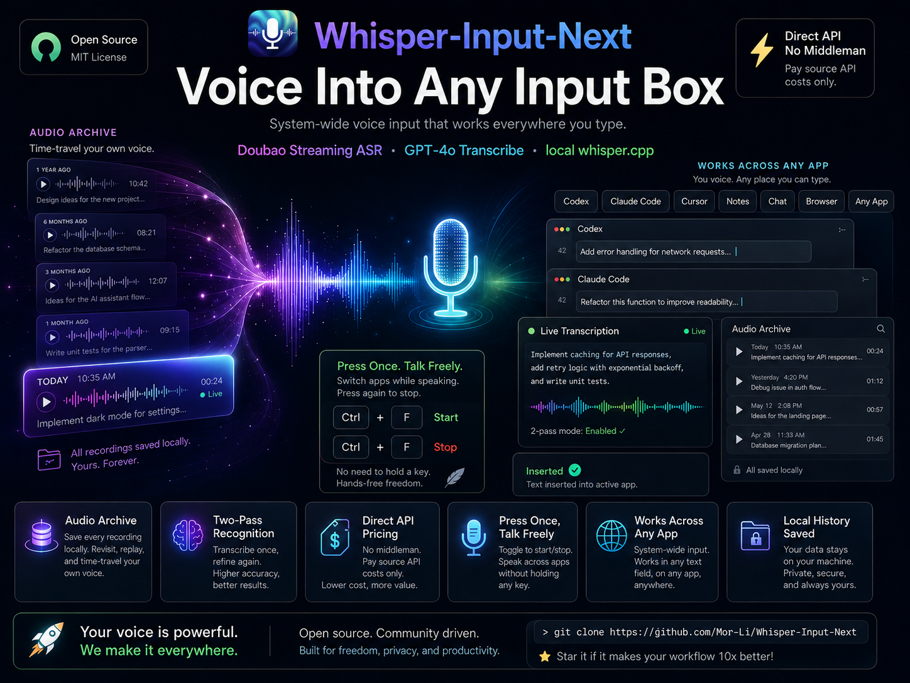

# Whisper-Input-Next - Enhanced Voice Transcription Tool

<p align="center">
  
</p>

<p align="center">
  <a href="./[V3.1.0]_VERSION_CONTROL.md">
    
  </a>
  <a href="https://www.python.org/">
    
  </a>
  <a href="../LICENSE">
    
  </a>
  <a href="../README.md">
    
  </a>
</p>

一个语音转文字的智能输入工具，能把你说的话直接打到**系统里任何一个输入框**——Cursor、Claude Code、Codex、Gemini、浏览器、Slack、备忘录，哪儿都行，不绑定任何单一 app。

## 🌟 为什么选 Whisper-Input-Next？

- **🖐️ 真正免手，按一次就持续识别** —— 按一下 `Ctrl+F` 它就一直在听。你可以切窗口、翻文档、去别的 app 复制点东西，再切回来——录音全程不中断。不用像 Typeless 那样一直长按某个键，所以你两只手都是自由的，工作流不被打断。
- **🌍 全系统通用** —— 它直接在你光标处输入文字，任何 app、任何输入框都能用，不只是某一个编辑器。在 Cursor / Claude Code / Codex 写代码、跟 Gemini 聊天、写邮件——同一个快捷键，处处可用。
- **🕰️ Audio Archive = 给声音的时光机** —— 每一段录音都在本地永久保存。一年后打开它，你能真的听到去年六月自己在做什么项目。这是你自己的"语音史"，私密地存在你自己的硬盘上——回去听过去的自己，有种近乎奇妙的时空穿越感。
- **💸 没有中间商赚差价** —— 你直接充源头厂商的 API（豆包 / OpenAI），按成本价用。充几块钱能用好几个月。我们一分钱不赚——没有订阅、没有加价、中间没人抽成。
- **🎯 二次识别（Two-Pass）** —— 说话停顿时，用准确率更高的非流式模型对每句话重新识别一遍，质量明显提升（例如"广告位" → "光标位置"）。
- **🔌 转录引擎任选** —— 豆包流式 ASR（默认，超便宜）、OpenAI GPT-4o transcribe，或完全离线的本地 whisper.cpp。

> 🐧 **Linux 用户**：Linux 桌面端支持在 [`linux` 分支](https://github.com/Mor-Li/Whisper-Input-Next/tree/linux) 上,由 [@MiaoDX](https://github.com/MiaoDX) 贡献并维护,感谢！我自己用 macOS,不亲自测试/维护该分支,所以它可能会落后于 `main`,请到该分支跟踪或贡献。

## 🚀 项目背景

本项目基于 [ErlichLiu/Whisper-Input](https://github.com/ErlichLiu/Whisper-Input) 进行二次开发。原项目已停止维护数月，我们在其基础上进行了大量功能扩展和架构优化，添加了OpenAI GPT-4o transcribe集成、音频存档、本地whisper支持等重要功能。[为什么要用这个项目？](./[V3.0.0]_知乎blog.md)

## ✨ 主要特性

### 🎯 核心功能
- **多平台转录服务**: 支持OpenAI GPT-4o transcribe、GROQ、SiliconFlow、本地whisper.cpp
- **智能快捷键**: Ctrl+F (OpenAI高质量) / Ctrl+I (本地省钱模式)
- **音频存档**: 自动保存所有录音，支持历史回放
- **失败重试**: 智能错误处理和重试机制
- **实时状态**: 直观的录音和处理状态显示

### 🔧 技术特性
- **双处理器架构**: 同时支持云端和本地转录
- **180秒超时**: OpenAI专用长时间超时支持
- **自动标点**: GPT-4o transcribe自带标点符号
- **隐私保护**: 本地处理选项，数据不上传
- **光标零位移快捷键** *(macOS)*: 在 Quartz 事件层拦截录音快捷键，按键切换录音不会移动文本光标（`Ctrl+F`/`Ctrl+I` 不再触发系统自带的"光标右移/Tab"），可精确插入到文本任意位置；且会自动跟随你配置的快捷键。[详细说明](./HOTKEY_CURSOR_FIX.md)

## 📦 快速开始

### 环境要求
- Python 3.12+
- macOS/Linux (Windows支持开发中)
- 网络连接 (仅云端服务需要)
- **本地whisper.cpp** (使用本地转录功能时需要)

### 安装步骤

1. **克隆项目**
```bash
git clone https://github.com/Mor-Li/Whisper-Input-Next.git
cd Whisper-Input-Next
```

2. **创建虚拟环境**
```bash
python -m venv venv
source venv/bin/activate  # macOS/Linux
# 或 venv\\Scripts\\activate  # Windows
```

3. **安装依赖**
```bash
pip install -r requirements.txt
```

4. **安装本地whisper.cpp (可选，使用本地转录时需要)**
```bash
# 克隆whisper.cpp仓库
git clone https://github.com/ggerganov/whisper.cpp.git
cd whisper.cpp

# 编译 (macOS/Linux)
make

# 下载模型文件 (推荐large-v3)
bash ./models/download-ggml-model.sh large-v3

# 记录whisper-cli路径，稍后配置到.env文件
echo "Whisper CLI 路径: $(pwd)/build/bin/whisper-cli"
cd ..
```

5. **配置环境变量**
```bash
cp env.example .env
# 编辑 .env 文件，配置必要参数:
# - OFFICIAL_OPENAI_API_KEY: OpenAI API密钥 (必需)
# - WHISPER_CLI_PATH: whisper.cpp可执行文件路径 (使用本地转录时必需)
# - WHISPER_MODEL_PATH: whisper模型文件路径 (使用本地转录时必需)
```

6. **运行程序**
```bash
python main.py
# 或使用启动脚本
chmod +x start.sh
./start.sh
```

### ⚠️ 重要说明

**必需配置项：**
- `OFFICIAL_OPENAI_API_KEY`: OpenAI GPT-4o transcribe API密钥
- `WHISPER_CLI_PATH`: 本地whisper.cpp可执行文件绝对路径
- `WHISPER_MODEL_PATH`: whisper模型文件路径 (相对于whisper.cpp根目录)

**whisper.cpp安装指南：**
1. 从 [whisper.cpp仓库](https://github.com/ggerganov/whisper.cpp) 克隆并编译
2. 下载large-v3模型: `bash ./models/download-ggml-model.sh large-v3`
3. 在.env中配置正确的路径

## ⚙️ 配置说明

### 环境变量配置

在 `.env` 文件中配置以下参数：

```bash
# 服务平台选择 (推荐使用我们维护的双平台配置)
SERVICE_PLATFORM=openai&local  # 我们主要维护的配置

# OpenAI 配置 (必需)
OFFICIAL_OPENAI_API_KEY=sk-proj-xxx

# 本地whisper.cpp配置 (使用本地转录时必需)
WHISPER_CLI_PATH=/path/to/whisper.cpp/build/bin/whisper-cli
WHISPER_MODEL_PATH=models/ggml-large-v3.bin

# 键盘快捷键配置
TRANSCRIPTIONS_BUTTON=f
TRANSLATIONS_BUTTON=ctrl
SYSTEM_PLATFORM=mac  # mac/win

# 功能开关
CONVERT_TO_SIMPLIFIED=false
ADD_SYMBOL=false
OPTIMIZE_RESULT=false
```

**重要说明**: 
- 本项目主要维护 `SERVICE_PLATFORM=openai&local` 配置
- 这是我们推荐和测试最充分的配置
- 其他单平台配置（groq、siliconflow等）仅作兼容性保留

## 🐛 故障排查（踩坑记录）

### 豆包流式 ASR 连接时报 `403`

如果一按下录音键就立刻看到类似下面的报错：

```
ERROR - 连接豆包 ASR 失败: 403, message='Invalid response status', url='wss://openspeech.bytedance.com/api/v3/sauc/bigmodel_async'
ERROR - ❌ 豆包流式转录错误: 连接失败
```

**这几乎一定是你火山引擎账号的应用「没有开通对应能力」，而不是代码 bug、也不是 endpoint 写错了。** 这个 `403` 是在 WebSocket **握手阶段**（网关层，鉴权之前）返回的——这正是"`X-Api-Resource-Id` 对应的能力没给你的应用开通"的典型特征。

本项目使用的 resource id 是 `volc.seedasr.sauc.duration`，对应的是 **豆包流式语音识别模型 2.0 · 小时版**。你必须在控制台把这个能力**显式勾选开通**：

1. 打开火山引擎语音控制台：[https://console.volcengine.com/speech/app](https://console.volcengine.com/speech/app)
2. 找到你的应用，点击 **编辑应用**。
3. 在 **接入能力** 里找到 **豆包流式语音识别模型 2.0**，勾选 **豆包流式语音识别模型 2.0 小时版**（下图红框处）。
4. 保存后重新运行程序即可。

<p align="center">
  
</p>

> **注意**：不要为了绕过这个错误把 resource id 降级成旧的 `volc.bigasr.sauc.*` 命名空间。`volc.seedasr.sauc.duration`（2.0）这个 endpoint 本来就是对的——正确的修复是去控制台开通 2.0，而不是改代码。降级到 1.0 只会掩盖真正的权限问题，而且用的是准确率更低的旧模型。

> 火山引擎的控制台入口藏得比较深、来回跳转，找不到的话直接用上面的 `speech/app` 链接进去即可。

### 便捷启动别名设置 (推荐)

在shell配置文件中添加以下别名 (`~/.bashrc`、`~/.zshrc` 等)：

```bash
alias whisper_input='cd /path/to/Whisper-Input-Next && ./start.sh'
alias whisper_input_off='tmux kill-session -t whisper-input'
```

请将 `/path/to/Whisper-Input-Next` 替换为你的项目实际路径。

### 快捷键说明

| 快捷键 | 功能 | 服务 | 特点 |
|--------|------|------|------|
| `Ctrl+F` | 高质量转录 | OpenAI GPT-4o transcribe | 自带标点，质量最高 |
| `Ctrl+I` | 本地转录 | whisper.cpp | 离线处理，隐私保护 |

### 状态指示器

程序运行时会在光标位置显示简洁的状态指示器：

| 状态 | 含义 | 操作 |
|------|------|------|
| `0` | 正在录音 | 再次按快捷键停止录音 |
| `1` | 正在转录 | 请等待转录完成 |
| `!` | 转录失败/出错 | 再次按`Ctrl+F`重试（音频已保存） |

**设计优化**：
- 使用简洁数字状态，避免复杂emoji符号
- 不污染系统剪贴板，只在光标位置显示
- 状态清晰明了，便于快速识别

**重试机制说明**：
- 当转录失败时，系统会保存录音并显示`!`状态
- 此时无需重新录音，直接按`Ctrl+F`即可重试
- 重试会使用之前保存的音频，直到转录成功

## 📚 功能文档

**功能说明**

- [🔊 音频存档与转录缓存](./[V3.0.0]_AUDIO_ARCHIVE_FEATURE.md) - *v3.0.0引入，v3.3.1加固*
- [🛡️ 转录缓存的数据安全](./TRANSCRIPTION_CACHE_SAFETY.md) - *v3.3.1* —— 缓存为什么不会再自己清空，万一出事怎么抢救
- [⚡ 异步转录队列](./[V3.2.0]_ASYNC_TRANSCRIPTION_QUEUE.md) - *v3.2.0引入*
- [🔔 音频设备断开通知](./device_notification.md)
- [🖥️ macOS 状态栏指示器](./[V3.3.0]_STATUS_BAR.md) - *v3.3.0引入*
- [📊 状态显示优化](./[V3.0.0]_STATUS_DISPLAY_IMPROVEMENTS.md) - *v3.0.0引入*

**macOS 快捷键的坑**

- [🖱️ 光标位移修复](./HOTKEY_CURSOR_FIX.md) —— `Ctrl+F`/`Ctrl+I` 为什么不会再顶走光标
- [🔧 热键失灵自愈](./HOTKEY_DEAD_TAP_SELFHEAL.md) - *v3.3.1* —— 按键突然没反应先看这篇

**项目背景**

- [🔄 分支差异对比](./[V3.0.0]_BRANCH_DIFFERENCES.md) - *v3.0.0引入*
- [📋 版本控制文档](./[V3.1.0]_VERSION_CONTROL.md) - *v3.1.0建立*
- [📝 v3.1.0 更新说明](./[V3.1.0]_RELEASE_NOTES.md)
- [✍️ 为什么做这个项目（知乎）](./[V3.0.0]_知乎blog.md)

**已废弃**

- [🤖 Kimi润色集成](./[DEPRECATED]_KIMI_USAGE.md)
- [📄 上游原项目 README 存档](./[DEPRECATED]_README_upstream.md)

## 🛠️ 开发状态

### ✅ 已完成功能
- [x] OpenAI GPT-4o transcribe集成 (180秒超时)
- [x] 双处理器架构 (云端+本地)
- [x] 音频存档系统 + 转录缓存(cache.json)
- [x] 智能重试机制 (多次失败循环重试)
- [x] 状态显示优化 (0→1→!)
- [x] 本地whisper.cpp支持
- [x] 项目文档完善

### 🚧 正在开发  
*当前无正在开发的功能*

### 📋 计划功能
*当前无计划功能*

### 🧪 实验性功能历史

#### iOS键盘扩展实验 (2025年8月14日)
**状态**: ❌ 因Apple限制而中止  
尝试创建iOS键盘扩展但发现连搜狗输入法都无法在键盘扩展中直接录音，受Apple系统限制。iOS语音输入目前无法作为无缝键盘扩展实现。

## 🤝 贡献指南

欢迎提交Issues和Pull Requests！

### 开发环境设置
```bash
# 克隆项目
git clone https://github.com/Mor-Li/Whisper-Input-Next.git
cd Whisper-Input-Next

# 设置开发模式
pip install -r requirements.txt
pip install -e .

# 运行测试
python -m pytest test/
```

### 提交规范
- feat: 新功能
- fix: 修复问题  
- docs: 文档更新
- style: 代码风格
- refactor: 重构
- test: 测试相关

## 📄 许可证

本项目采用 MIT 许可证。详见 [LICENSE](../LICENSE) 文件。

## 🙏 致谢

- 感谢 [ErlichLiu](https://github.com/ErlichLiu) 提供的原始项目基础
- 感谢 OpenAI 提供的强大转录服务
- 感谢所有贡献者和用户的支持

## 📞 联系方式

- **项目地址**: https://github.com/Mor-Li/Whisper-Input-Next  
- **问题报告**: [Issues](https://github.com/Mor-Li/Whisper-Input-Next/issues)
- **功能建议**: [Discussions](https://github.com/Mor-Li/Whisper-Input-Next/discussions)

---

**⭐ 如果这个项目对你有帮助，请给个Star支持一下！**