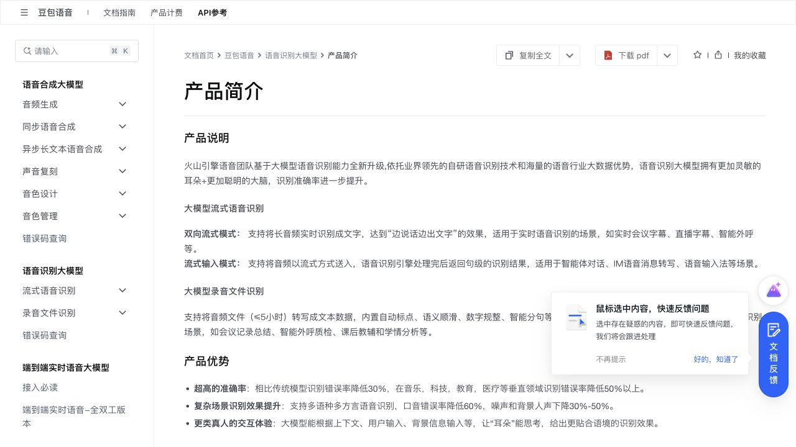
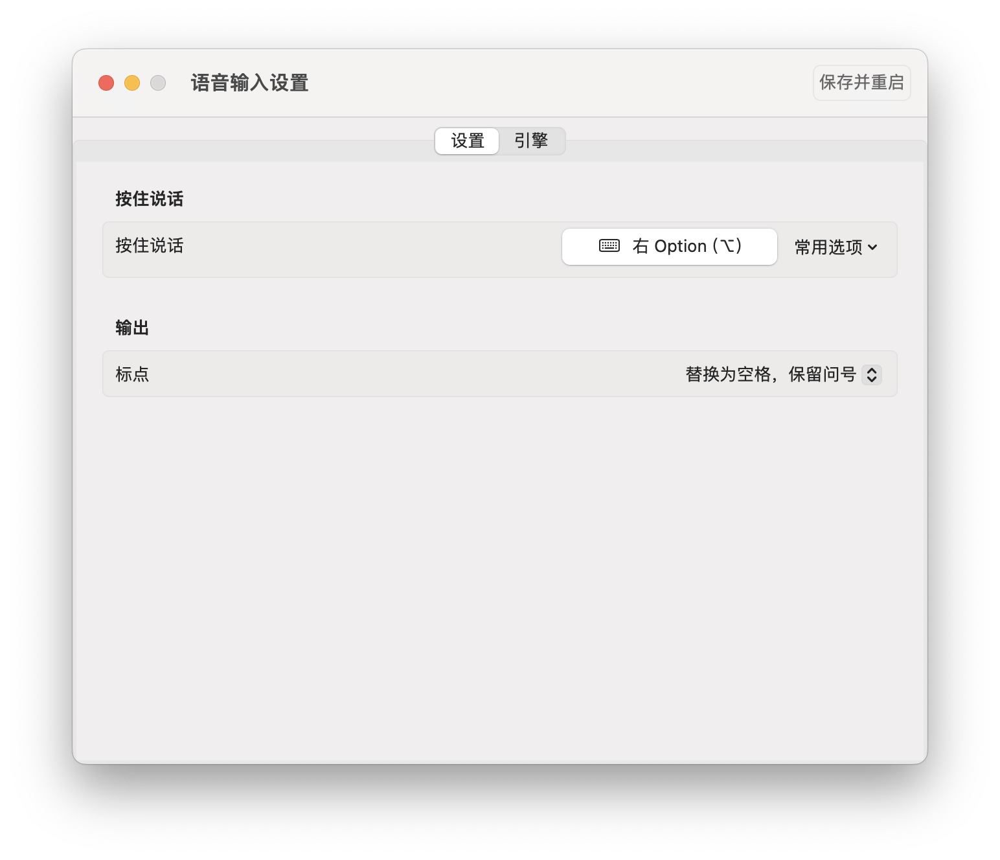
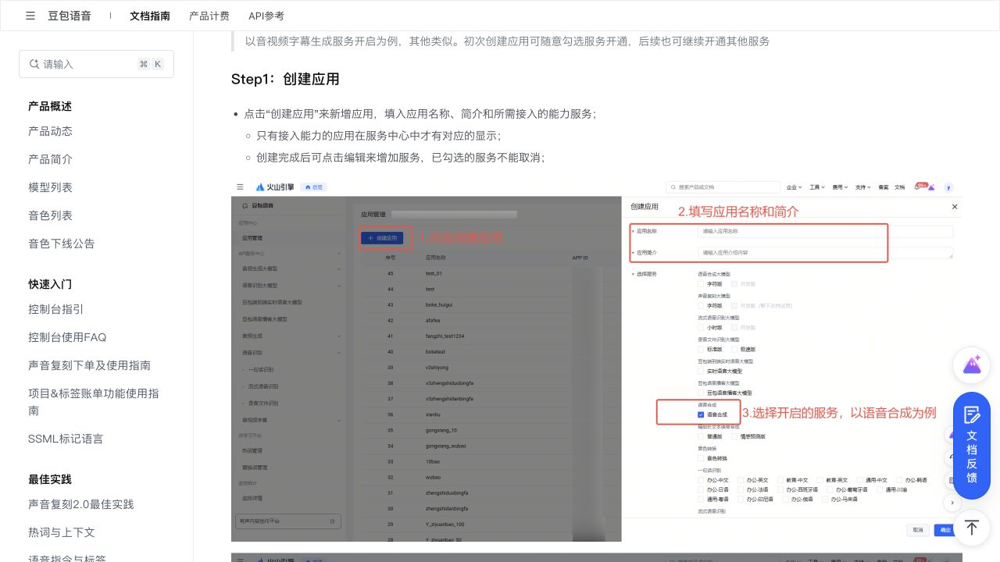
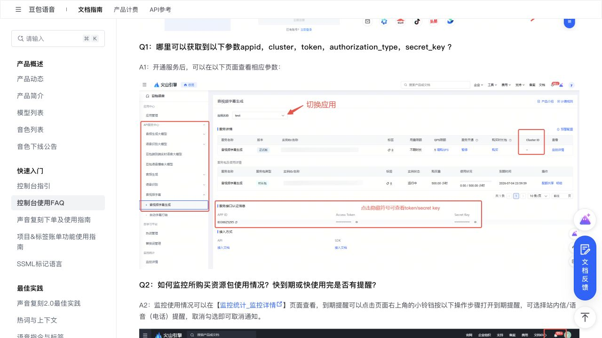
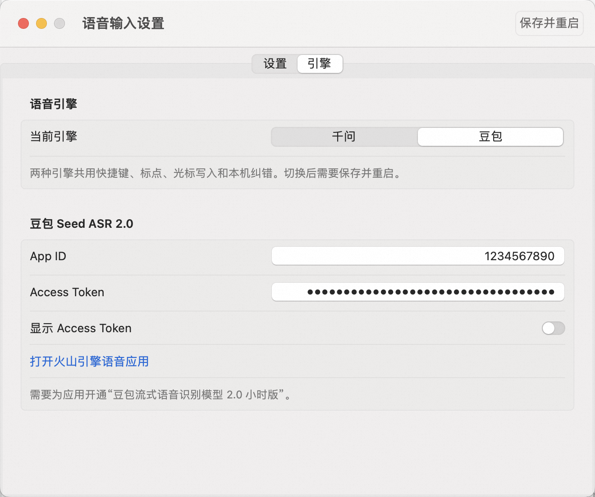
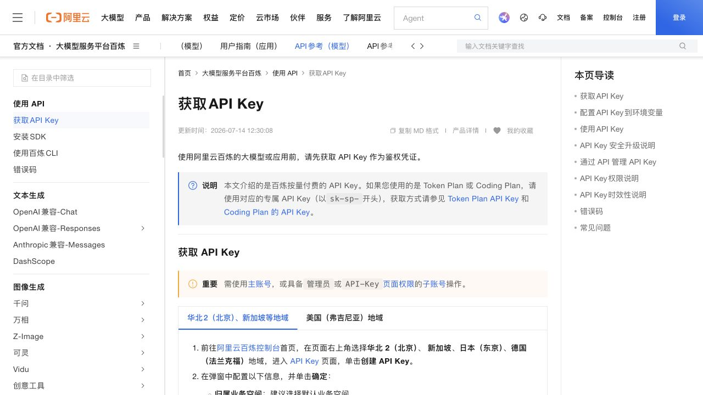
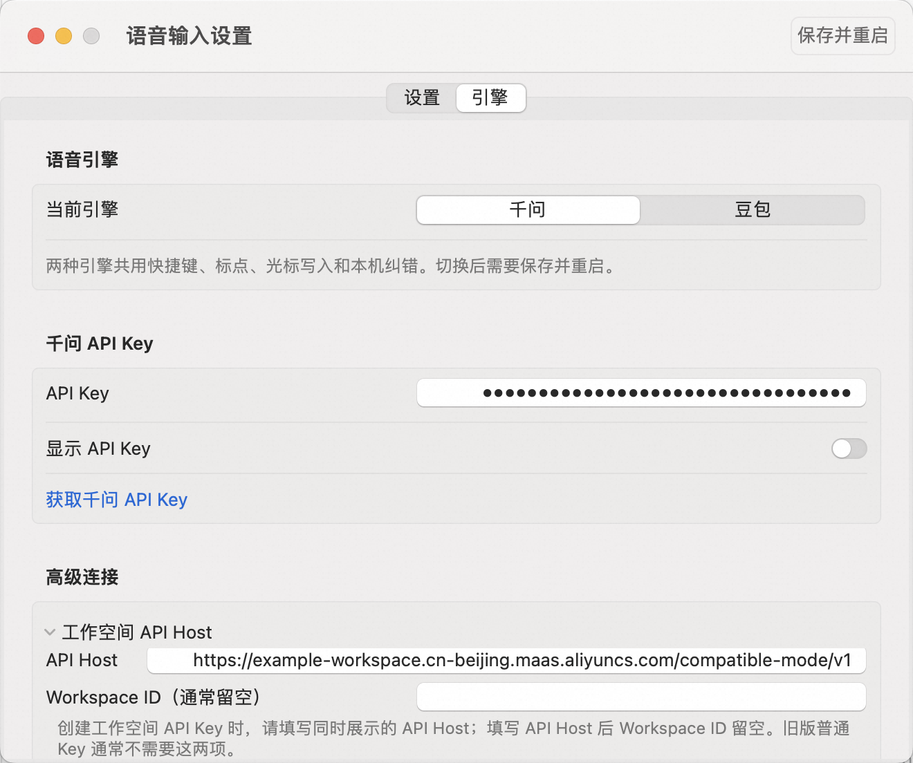

# VoxType：快速开始与 API 配置

本文面向第一次安装 VoxType 的用户。你只需要安装 App、授权、选择语音引擎并填入自己的 API 凭证；不需要安装豆包输入法、千问输入法或 Python。

> 安全提醒：截图中的 `1234567890` 和圆点 Token 都是演示数据。不要把真实 API Key、Access Token、`.env`、录音、个人词汇或纠错记录提交到代码仓库或发给别人。

## 1. 先选语音引擎

VoxType 支持千问 Qwen Audio 3.0 ASR Streaming 和豆包 Seed ASR 2.0。两者共用快捷键、标点、悬浮声波、光标写入与识别词汇。

在本项目一次“同一台 Mac、同一支麦克风、同一份约 40 秒内存音频、小声中文夹专业术语”的对比中：

| 项目 | 千问 | 豆包 |
| --- | --- | --- |
| 首次预览 | 约 0.68 秒 | 约 5.52 秒 |
| 完整处理 | 约 41.08 秒 | 约 42.63 秒 |
| 最终准确率 | 专业术语和部分同音词错误较多 | 对 L1/L2 等术语和整句语义明显更准确 |
| 适合 | 更看重首字速度 | 更看重最终准确率，尤其小声和专业术语 |

因此，**当前这组实测更推荐豆包**。这不是对所有口音、麦克风和网络环境的普遍保证；你也可以运行 `python tools/compare_asr_once.py --duration 12`，用同一份仅驻留内存的音频比较自己的环境。

火山引擎官方介绍中，大模型流式识别支持边说边出文字、自动标点、语义顺滑和智能分句：

## 2. 安装与首次授权

1. 打开维护者提供的 `Voice-Input-v3.7.3-macOS-arm64-internal.dmg`，把 `VoxType` 拖入“应用程序”。
2. 首次启动若被 macOS 拦截，在 Finder 中右键 App 选择“打开”，或到“系统设置 → 隐私与安全性”选择“仍要打开”。
3. 在“系统设置 → 隐私与安全性”允许 `VoxType` 使用：
   - **麦克风**：录音必需。
   - **辅助功能**：把最终文字写到当前光标处必需。
   - **输入监控**：使用右 Option、Fn/Globe、右 Command 等单键全局快捷键时必需。
4. 如果公司安全软件不允许输入监控，把快捷键改为 `Control + Option + Space` 的“系统注册组合键”。它只注册这一组组合键；写字仍需要辅助功能。

默认操作是：把光标放进输入框，按住快捷键说话，松开后提交最终文字。点击菜单栏波形图标只会打开设置，不会开始录音。

安装完成后还需要从“应用程序”里至少启动一次 `VoxType`。如果 App 正在运行但没有看到图标，请先再次打开 App 唤起设置，再检查菜单栏图标是否被刘海或过多状态项遮住；退出 App 或重启电脑后，只有开启“登录后自动启动”才会自动恢复菜单栏图标。

## 2.1 添加识别词汇

打开“设置 → 输出 → 识别词汇”，每行填写一个确实容易被误识别的人名、品牌名、产品名、项目代号或行业专有术语。不要填入整句背景介绍，也不要大量添加普通常用词，否则可能干扰整体识别。

点击“完成”后，再点主窗口右上角“保存并重启”。这份词表只保存在当前用户的 Mac 上。千问会把它作为请求级词汇发送；豆包会同时发送词汇提示与英文专有名词的精确拼写规则。

## 3. 配置豆包（当前实测推荐）

### 3.1 创建语音应用

1. 登录[火山引擎豆包语音控制台](https://console.volcengine.com/speech/app)。
2. 点击“创建应用”，填写应用名称与简介。
3. 为应用选择并开通 **豆包流式语音识别模型 2.0 小时版**。当前程序使用的资源 ID 是 `volc.seedasr.sauc.duration`；如果开通了别的录音文件识别或语音合成服务，凭证可能存在但本程序仍会被拒绝。
4. 试用或正式版额度、计费和欠费规则以火山引擎控制台的实时说明为准。

官方“创建应用”示意：

### 3.2 找到 App ID 与 Access Token

1. 进入已创建应用的服务详情。
2. 切换到正确的应用。
3. 在服务接口认证信息中找到 **APP ID** 与 **Access Token**。
4. 妥善保存；不要把 Token 放进截图、聊天、Issue 或 Git 提交。

火山引擎官方 FAQ 标出的凭证位置：

官方资料：

- [豆包语音控制台快速入门](https://www.volcengine.com/docs/6561/163043?lang=zh)
- [控制台使用 FAQ：在哪里获取 App ID 和 Token](https://www.volcengine.com/docs/6561/196768?lang=zh)
- [大模型流式识别 SDK / 鉴权说明](https://www.volcengine.com/docs/6561/1395846?lang=zh)

### 3.3 填入 VoxType

1. 点击菜单栏的 VoxType 波形图标，打开设置。
2. 进入“引擎”，选择“豆包”。
3. 将数字 **App ID** 填入 `App ID`。
4. 将完整 **Access Token** 填入 `Access Token`；本 App 会按接口协议发送，用户不需要手动添加 `Bearer` 前缀。
5. 点击“保存并重启”。

如果对固定专有名词的识别稳定性要求较高，可在火山引擎“自学习平台 → 热词管理”创建 UTF-8 词表，再把该词表 ID 填入 VoxType 的“热词表 ID”。热词表必须与当前 App ID 属于同一个语音应用。

## 4. 配置千问

### 4.1 创建 API Key

本 App 使用的是**阿里云百炼 API Key**，不是阿里云 AccessKey ID/Secret，也不是 API Key 列表中的数字 ID。

1. 登录[阿里云百炼 API Key 页面](https://bailian.console.aliyun.com/?tab=model#/api-key)。
2. 确认地域。当前 App 默认配置为华北 2（北京）。
3. 点击“创建 API Key”，建议先使用默认业务空间。
4. 权限可以选择“全部”；如果使用自定义最小权限，至少允许 `qwen-audio-3.0-asr-flash-streaming`。
5. 创建成功后立即保存完整 **API Key** 和 **API Host**。新版工作空间 Key 通常以 `sk-ws-` 开头，明文只在创建成功时展示一次；丢失后应重置或重建，不要尝试从日志找回。

官方资料：

- [获取百炼 API Key](https://help.aliyun.com/zh/model-studio/get-api-key/)
- [千问实时语音识别](https://platform.qianwenai.com/docs/developer-guides/speech/asr-realtime)
- [语音识别模型总览](https://help.aliyun.com/zh/model-studio/asr-model/)

### 4.2 填入 VoxType

1. 打开 VoxType 设置，进入“引擎”，选择“千问”。
2. 填入完整 API Key。
3. 填入同一 API Key 页面展示的 **OpenAI compatible API 地址**。该项是必填项，必须与 Key 的地域、业务空间或套餐匹配。
4. 普通北京按量付费 Key 可使用 `https://dashscope.aliyuncs.com/compatible-mode/v1`；如果页面展示了工作空间专属地址，建议直接使用页面上的地址。Token Plan 等套餐的 Key 与普通 Base URL 不可混用。
5. 点击“保存并重启”。

## 5. 验证与常见问题

### 按快捷键没有反应

- 右 Option 只指键盘右侧的 Option；先在设置中确认当前快捷键。
- 检查麦克风、辅助功能和输入监控是否都授权给当前 `/Applications/VoxType.app`。
- 无 Developer ID 的内测 App 使用 ad-hoc 签名。**每次替换或重新构建 App 后，macOS 可能把它视为新的程序**。若升级后快捷键失效，请在“辅助功能”和“输入监控”中删除旧条目，重新添加当前 App，再完全退出并重开 VoxType。
- 密码框、锁屏、Secure Input 或企业安全软件可能阻止全局单键监听；改用 `Control + Option + Space`。

### 有波形但没有文字

- 先在普通文本编辑器中测试，排除目标 App 的安全输入限制。
- 检查辅助功能；没有它就无法把文字写入光标。
- 检查引擎凭证与所开通的服务是否匹配。
- 程序不会模拟 Return，因此不会自动发送聊天消息。最终文字会短暂进入剪贴板完成粘贴，随后恢复原内容，并添加短暂、保密、自动生成标记，尽量避免被支持该约定的剪贴板历史工具记录。

### 更新后出现两个菜单栏图标或重复输入

只保留 `/Applications/VoxType.app` 一份，退出所有旧版本后再启动当前版本。不要同时运行源码版 LaunchAgent、Backup App 和新 App。

## 6. 数据与隐私

- 音频默认只在内存中采集并发送给你选择的云 ASR，`AUDIO_ARCHIVE_ENABLED=false` 时不落盘。
- 最终文本通过标准 `Command+V` 进入当前光标，以兼容 Qoder、VS Code、Codex 等 Electron 编辑器；原剪贴板的多种数据格式会在粘贴后恢复。
- API 凭证、设置和纠错数据保存在当前用户本地；源码仓库不会包含这些文件。
- 调用云 ASR 必然把音频发送给相应云厂商。云端传输、日志、留存和计费规则以用户与阿里云/火山引擎之间的实时协议为准，项目不能承诺“云端零留存”。
- 详细边界见仓库根目录的 [SECURITY.md](../SECURITY.md)。
